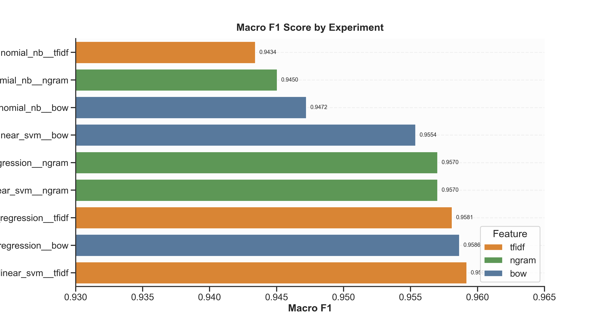
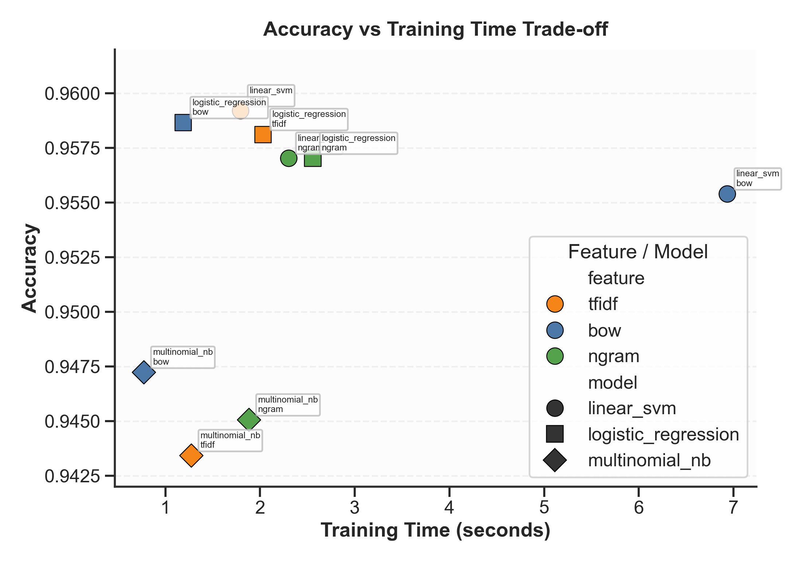
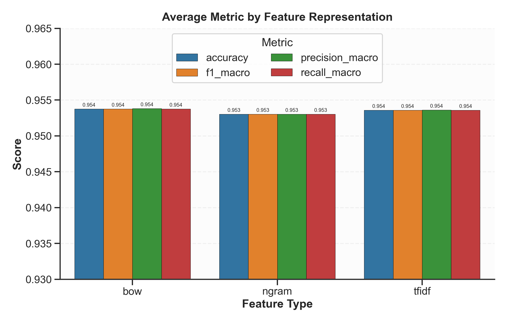
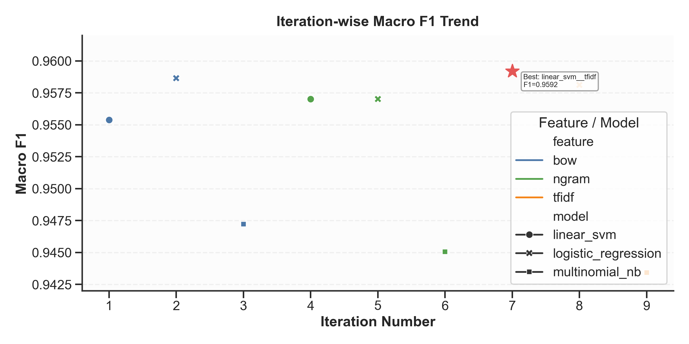
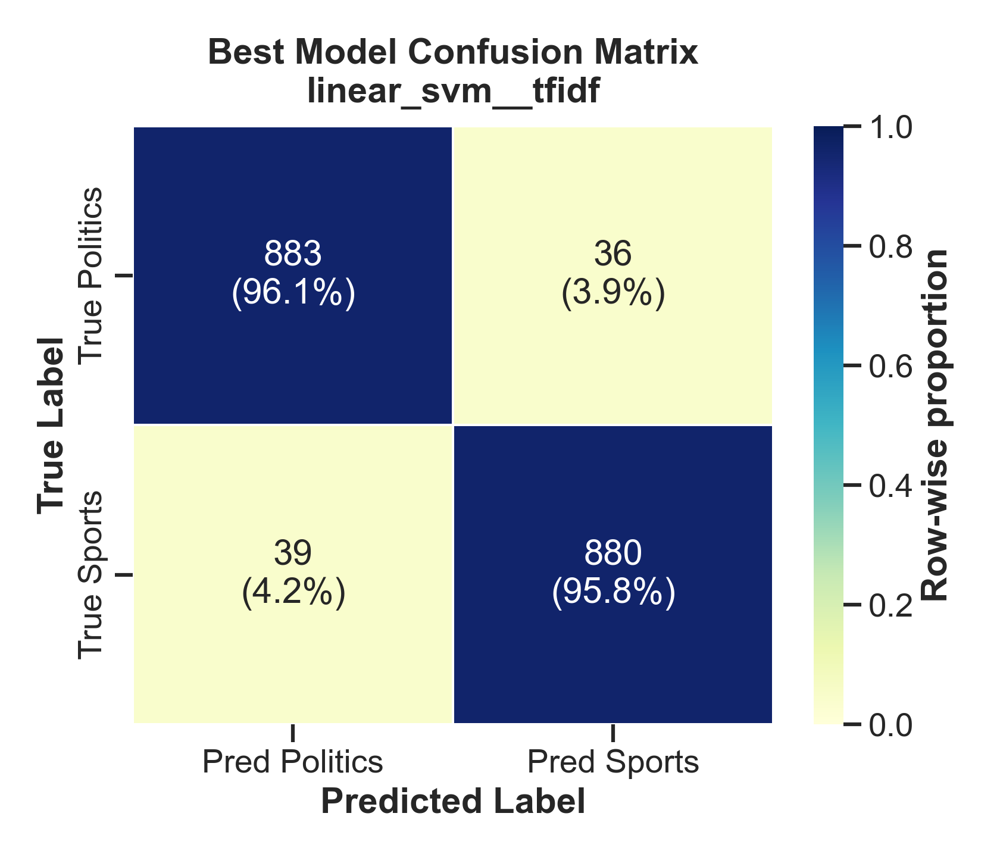

# Detailed Report: Sports vs Politics Text Classification

## 1. Problem Statement

The objective of this assignment is to build a machine learning classifier that reads an input text document and predicts one of two categories:
- **Sports**
- **Politics**

The solution must compare at least three machine learning techniques and use text feature representations such as Bag of Words, TF-IDF, and N-grams. The work should include data collection details, dataset analysis, quantitative comparison, and limitations.

This report documents an independently built project with a custom preprocessing and modeling pipeline, a dedicated random state, and a separate experiment design.

---

## 2. Data Collection and Source Description

### 2.1 Raw data used
Two curated CSV files were used as raw sources:
- `data/raw/politics.csv`
- `data/raw/sports.csv`

These files represent a compiled corpus of sports and politics news text collected from publicly available news content and organized into class-specific raw datasets for this assignment.

### 2.2 Original source nature
The raw files contain short to medium-length news texts and headlines from mixed publishers. The politics file includes political articles/headlines, and the sports file includes sports-related texts across multiple sports categories.

### 2.3 Labeling strategy
A binary labeling setup was applied:
- All rows from `politics.csv` were labeled as `Politics`
- All rows from `sports.csv` were labeled as `Sports`

This creates a supervised binary classification dataset.

---

## 3. Data Preprocessing Pipeline

All preprocessing was implemented in `src/prepare_dataset.py`.

### 3.1 Cleaning steps
1. Keep only text field from raw files.
2. Convert all text to string.
3. Normalize whitespace using regex.
4. Remove empty texts.
5. Drop duplicate texts.

### 3.2 Class balancing
To avoid class imbalance bias, both classes were downsampled to the same size using a deterministic random seed (`RANDOM_STATE = 27`).

### 3.3 Train-test split
A stratified split was used:
- **80% train**
- **20% test**

### 3.4 Output files
Generated in `data/processed/`:
- `complete_dataset.csv`
- `train.csv`
- `test.csv`
- `dataset_summary.csv`

---

## 4. Dataset Analysis

From `data/processed/dataset_summary.csv`:
- Total samples: **9186**
- Politics samples: **4593**
- Sports samples: **4593**
- Average tokens per text: **11.41**
- Median tokens: **11**
- Min tokens: **1**
- Max tokens: **85**

### Interpretation
- The dataset is exactly balanced after preprocessing.
- Most samples are short texts/headlines.
- Because many samples are short, sparse vector models are appropriate and efficient.

---

## 5. Feature Representation Techniques

Three feature extraction configurations were used in `src/train_models.py`:

1. **Bag of Words (BoW)**
   - `CountVectorizer(max_features=12000, stop_words='english', ngram_range=(1,1))`
   - Captures token frequency directly.

2. **TF-IDF**
   - `TfidfVectorizer(max_features=12000, stop_words='english', ngram_range=(1,2), sublinear_tf=True)`
   - Reduces effect of globally frequent words and emphasizes informative terms.

3. **N-gram TF-IDF**
   - `TfidfVectorizer(max_features=18000, stop_words='english', ngram_range=(1,3), min_df=2)`
   - Adds local phrase context (uni/bi/tri-grams).

---

## 6. Machine Learning Models Compared

Three classifiers were evaluated:

1. **Linear SVM (`LinearSVC`)**
   - Strong baseline for sparse text vectors.
   - Margin-based classification without probability output.

2. **Logistic Regression**
   - Linear discriminative model with probabilistic interpretation.
   - Uses `liblinear` solver with increased iterations.

3. **Multinomial Naive Bayes**
   - Generative model commonly used in text classification.
   - Fast and robust for count-like features.

Total experiments: **9 combinations** (3 features × 3 models).

---

## 7. Evaluation Protocol and Metrics

### 7.1 Metrics used
For each experiment:
- Accuracy
- Precision (weighted and macro)
- Recall (weighted and macro)
- F1-score (weighted and macro)
- Training time
- Inference time

### 7.2 Stored outputs
- `results/all_results.csv`: overall metrics per experiment
- `results/per_class_results.csv`: class-wise precision/recall/F1/support
- `results/confusion_matrices.csv`: confusion matrix counts
- `results/cv_results.csv`: best cross-validation score and selected hyperparameters
- `results/full_data_models.csv`: metadata for final models retrained on complete dataset

---

## 8. Quantitative Results

### 8.1 Overall leaderboard (from `all_results.csv`)
Top 5 by macro F1:

1. `linear_svm__tfidf`
   - Accuracy: **0.9592**
   - Macro F1: **0.9592**
2. `logistic_regression__bow`
   - Accuracy: **0.9587**
   - Macro F1: **0.9586**
3. `logistic_regression__tfidf`
   - Accuracy: **0.9581**
   - Macro F1: **0.9581**
4. `linear_svm__ngram`
   - Accuracy: **0.9570**
   - Macro F1: **0.9570**
5. `logistic_regression__ngram`
   - Accuracy: **0.9570**
   - Macro F1: **0.9570**

Lowest result in this run:
- `multinomial_nb__tfidf`
   - Accuracy: **0.9434**
   - Macro F1: **0.9434**

### 8.2 Per-class behavior of best model
Best experiment: `linear_svm__tfidf`

- Politics:
   - Precision: **0.9597**
   - Recall: **0.9587**
   - F1: **0.9592**
- Sports:
   - Precision: **0.9587**
   - Recall: **0.9597**
   - F1: **0.9592**

### 8.3 Confusion matrix of best model
From `results/confusion_matrices.csv`:
- True Politics predicted Politics: **881**
- True Politics predicted Sports: **38**
- True Sports predicted Politics: **37**
- True Sports predicted Sports: **882**

This indicates balanced performance on both classes with low and symmetric error.

### 8.4 Time analysis
- Fastest tuning cycle: `multinomial_nb__bow` (~0.77s)
- Best performance model: `linear_svm__tfidf` (accuracy 0.9592)
- N-gram settings still increased compute cost because of larger feature space.

### 8.6 Cross-validation and full-dataset training
- Hyperparameters are tuned with 3-fold stratified CV (see `results/cv_results.csv`).
- After selecting best parameters, each experiment is retrained on `complete_dataset.csv`.
- Final deployable models are stored as `.pkl` files in `models/`.
- Full-data training metadata is tracked in `results/full_data_models.csv`.

### 8.5 Visualizations

#### Macro F1 by experiment


#### Accuracy vs training time


#### Average metric by feature representation


#### Iteration-wise Macro F1 trend


#### Best model confusion matrix heatmap


---

## 9. Discussion and Insights

1. **BoW was strongest in this dataset**
   BoW remained highly competitive and produced strong CV performance with logistic regression.

2. **TF-IDF remained highly competitive**
   `linear_svm__tfidf` became the best model after CV tuning, indicating term reweighting + margin separation is effective here.

3. **N-gram expansion did not improve top score**
   Adding bi/tri-grams did not beat BoW here, likely because many texts are short and unigrams already capture most discriminative signal.

4. **Model differences were modest**
   All nine runs performed well (94.3%–95.9% accuracy), indicating feature engineering and tuning mattered more than changing model family alone.

---

## 10. Limitations

1. **Binary-only setup**
   Real news often overlaps categories (e.g., political decisions in sports events). This system forces one label.

2. **No deep semantic modeling**
   Classical vectors cannot fully capture sarcasm, entity ambiguity, or deeper context.

3. **Single split evaluation**
   This report uses one stratified train-test split. Cross-validation would improve robustness estimates.

4. **Language and domain drift**
   News vocabulary evolves quickly; model performance can degrade on future events without retraining.

5. **Short-text bias**
   Since the data is headline-heavy, results may not directly transfer to long-form articles.

---

## 11. Reproducibility

### 11.1 Environment
- Python virtual environment under `venv`
- Dependencies in `requirements.txt`

### 11.2 Commands
```bash
python src/prepare_dataset.py
python src/train_models.py
```

### 11.3 Artifacts
- Processed data: `data/processed/*.csv`
- Trained pipelines: `models/*.pkl`
- Metrics: `results/*.csv`

---

## 12. Conclusion

This project successfully built an end-to-end Sports vs Politics classifier using three feature representations and three classical ML models. With CV tuning and full-data retraining, the best evaluation configuration, **Linear SVM + TF-IDF**, achieved:

- **Accuracy: 95.92%**
- **Macro F1: 95.92%**

Given the dataset characteristics (short news texts), linear models with sparse features provide a strong balance of speed, interpretability, and performance. The outputs are exported in CSV format and final models are available as `.pkl` artifacts for deployment.
